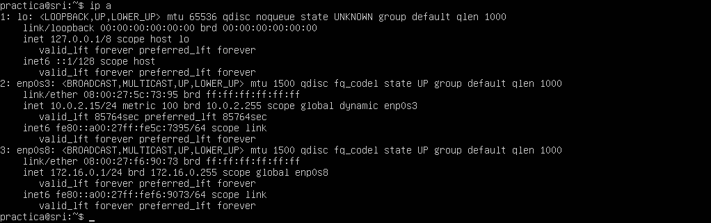
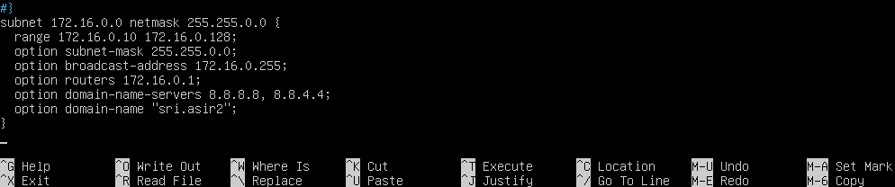
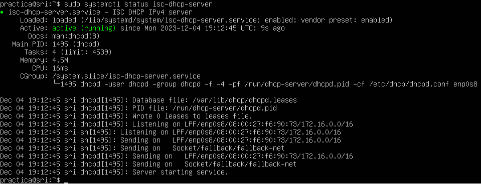
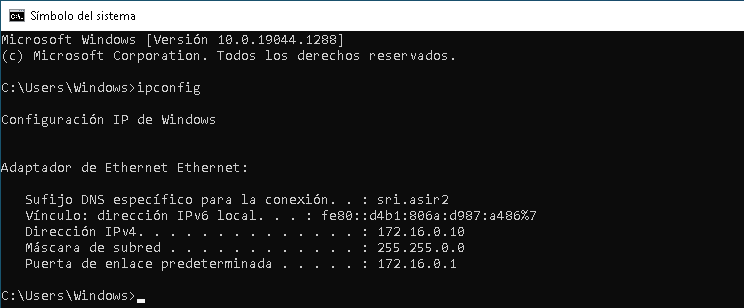
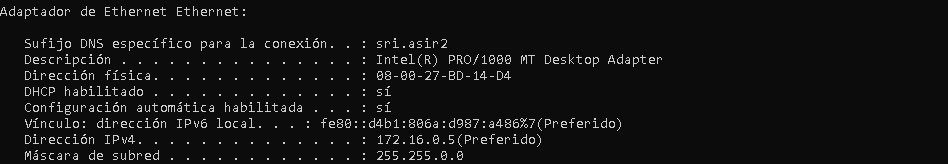

# Práctica: DHCP máquina virtual
## Prerrequisitos
Partimos de base de una máquina virtual con Ubuntu Server que dispone de dos interfaces de red, una configurada como NAT y otra como red interna.
Comprobamos dentro del servidor cuál es cada interfaz mediante el comando `ip a`. En este caso, la red externa está conectada a través de enp0s3 con IP 10.0.2.15. La red interna utilizará la interfaz enp0s8, con la IP 172.16.0.1, configurada de forma estática.

## Instalación del servicio DHCP
Editamos el archivo `/etc/sysctl.conf` y descomentamos la línea `net.ipv4.ip_forward=1` para activar el reenvío de paquetes IPv4. Una vez hecho, aplicamos los cambios ejecutando `sudo sysctl -p`. Si hemos editado el archivo correctamente, se mostrará dicha línea en pantalla al ejecutar el comando.

Finalmente, instalamos el servicio de servidor DHCP ejecutando el comando `sudo apt install isc-dhcp-server`.

## Configuración del servicio DHCP
Para configurar el servidor DHCP, editamos el archivo `/etc/dhcp/dhcpd.conf` y agregamos los datos de la subred que queremos administrar con dicho servidor. La subred será la 172.16.0.0/16, el rango de IPs a asignar mediante DHCP será de la 172.16.0.10 a la 172.16.0.128, con dirección de broadcast 172.16.0.255 y dirección de router 172.16.0.1 (el propio servidor).

Queda asignar este servidor DHCP a una interfaz de red, que será la interna
(enp0s8). Por lo tanto, editamos el archivo /etc/default/isc-dhcp-server e
introducimos dicha interfaz entre las comillas del apartado INTERFACESv4.

Para aplicar los cambios, podemos ejecutar el comando `sudo systemctl restart isc-dhcp-server`.

Una vez instalado, el servicio DHCP debería lanzarse automáticamente al iniciar el sistema. Si no fuese el caso, sería suficiente con ejecutar el comando `sudo systemctl enable isc-dhcp-server`.

Podemos comprobar que se encuentra en ejecución con `sudo systemctl status isc-dhcp-server`.

## Comprobación de que el servidor DHCP funciona correctamente
Para ello, utilizamos otra máquina virtual como cliente, con una única interfaz de red conectada a la red interna. Una vez arrancado, si ejecutamos en CMD el comando `ipconfig`, podemos comprobar que la IP asignada es la 172.16.0.10/16 (dentro del rango de IP configurado).

## Declarar una asignación por MAC fija a 172.16.0.5

Para ello, volvemos a editar el archivo `/etc/dhcp/dhcpd.conf` y, en la subred que añadimos anteriormente, declaramos la MAC a la que queremos asignar una IP de la siguiente manera.

Para comprobar que funciona, arrancamos el cliente que tiene la dirección MAC proporcionada en esta red, y haciendo en CMD un ipconfig /all podemos ver que se le ha asignado la IP que se requería.

