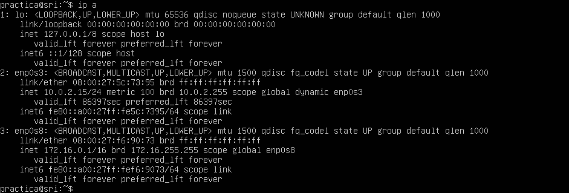

# Práctica: DHCP máquina virtual
## Prerrequisitos
Partimos de base de una máquina virtual con Ubuntu Server que dispone de dos interfaces de red, una configurada como NAT y otra como red interna.
Comprobamos dentro del servidor cuál es cada interfaz mediante el comando `ip a`. En este caso, la red externa está conectada a través de enp0s3 con IP 10.0.2.15. La red interna utilizará la interfaz enp0s8, con la IP 172.16.0.1, configurada de forma estática.

## Instalación del servicio DHCP
Editamos el archivo `/etc/sysctl.conf` y descomentamos la línea `net.ipv4.ip_forward=1` para activar el reenvío de paquetes IPv4. Una vez hecho, aplicamos los cambios ejecutando `sudo sysctl -p`. Si hemos editado el archivo correctamente, se mostrará dicha línea en pantalla al ejecutar el comando.

Finalmente, instalamos el servicio de servidor DHCP ejecutando el comando `sudo apt install isc-dhcp-server`.